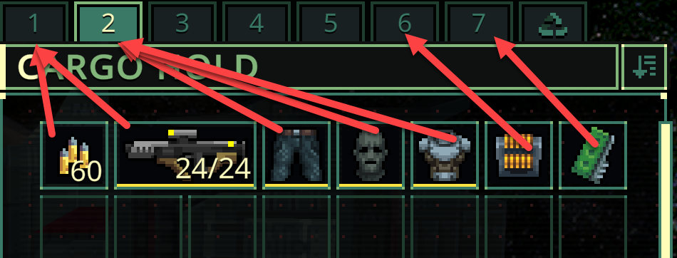

# Quasimorph Sort To Tabs



A mod to automatically move items to specific tabs using rules defined by the user.

For example, weapons to the first tab, ammo on the second, armor on the third, etc.

Press F5 to apply the move rules for the items on that tab.  Press S to invoke the game's normal sort.

The rules and hotkeys can be changed in the configuration file.

The mod starts with default search rules.  If there are any suggestions for better defaults, post a discussion or @ me on the [official Discord server](https://discord.gg/y8bRVNzzm6).

## Default Rules
The default rules are:

|Item|Destination Tab|
|--|--|
|Weapons|1|
|Ammo|2|
|Armor|3|
|Medical and Food|4|
|Repair Items|5|
|All other items|6|

# Save Backup

There have not been any reported issues, but as with all mods it would be best to backup the saves just in case.

The saves are located at `%AppData%\..\LocalLow\Magnum Scriptum Ltd\Quasimorph` and begin with `slot_` 

This warning is out of abundance of caution as there was another mod which moved items and had corruption issues.

# Configuration

## Files

The configuration file will be created on the first game run and can be found at `%AppData%\..\LocalLow\Magnum Scriptum Ltd\Quasimorph\QM_SortToTabs.json`.  

See the [rules](#rules) section below.

### Data
The rules are based on matches to items' identifiers.  The game exports those identifiers to `%AppData%\..\LocalLow\Magnum Scriptum Ltd\Quasimorph\QM_SortToTabs\DataExport.csv`, which is written on the game start.

If the data needs to be refreshed due to new items or categories being added to the game, delete the file and run the game.

## Shortcut Keys
The refresh and sort keys can be found in the config file.  Valid keys can be found at the bottom of https://docs.unity3d.com/ScriptReference/KeyCode.html

## Rules
The rules search for a match from top to bottom.  First match wins.
The rules have three optional parts:  Id (ex: army_knife), Type (ex: ArmorRecord), and the SubType (ex: QuestItem).  Any blank parts will not be used to match an item.

Any item that does not have a matching rule will not be moved.

Most rules will only need a single identifier set.

Example rules:

|TabNumber|Id|Type|SubType|Result|
|--|--|--|--|--|
|1|army_knife|||Moves all army knives to tab 1|
|2||WeaponRecord||Moves all weapons to tab 2|
|2||AmmoRecord||Moves all ammo to tab 2|
|7|||QuestItem|Moves all Quest items to tab 7|
|6||||(All Blank) moves all unmatched items to tab 6|

Example Entry in the config file:
```json
{
  "TabNumber": 1,
  "AltTabNumber": 0,
  "ItemMatch": {
    "Id": "",
    "RecordType": "WeaponRecord",
    "SubType": ""
  }
},

```
## DataExport.csv (Data Identifier Lookup)
The DataExport.csv file will contain the identifiers used by the rules.

Example data:
```
Id,Type,SubType
quest_fresco_data,TrashRecord,QuestItem
knuckles,WeaponRecord,
human_ear,TrashRecord,Resource
+merkUSB,DatadiskRecord,
```

## Special Recycling Rules
If the ship has the recycler and the recycler is not in use, the rules will treat the recycler as an 8th tab.

If a rule targets the 8th tab but the recyler is not available or in use, the rule will not move the item.
However, if the property `AltTabNumber` is set, that tab will be used as the target instead.

This allows a user to create a staging tab until the recycler is avaialbe.  When the recycler is ready, running the sort on that tab will move the staged items to the recycler.

Example:

```json
    {
      "TabNumber": 8,
      "AltTabNumber": 7,
      "ItemMatch": {
        "Id": "pmc_pistol",
        "RecordType": "",
        "SubType": ""
      }
    },
```

# Mod Upgrade Note
If the configuration file does not have the `AltTabNumber` option, either add it manually where needed, or delete the configuration file.  The game will generate a new config on start.


# Bad Config File
If the configuration has a loading issue (such as it being incorrectly formatted), the game will use the defaults.
There will be an error in the log player.log indicating this, but will not be obvious to users otherwise.

To recover, delete the config file and restart the game.  A new, config file with the defaults will be created.

# Debugging
To assist with debugging the rules while running the game, the mod will reload the configuration any time the file is saved.

The config option`DebugLogMatches` can be enabled to log which rule matched the item.

The game's log can be found here `%AppData%\..\LocalLow\Magnum Scriptum Ltd\Quasimorph\Player.log`

# Support
If you enjoy my mods and want to buy me a coffee, check out my [Ko-Fi](https://ko-fi.com/nbkredspy71915) page.
Thanks!

# Source Code
Source code is available on GitHub https://github.com/NBKRedSpy/QM_SortToTabs


# Change Log

## 1.2.0
* Version .8 support.

## 1.1.0
* Added Recycling upgrade support.
* Added Fast Trade and After Raid screens
* Included new `AltTabNumber` member for busy recycler rules.

